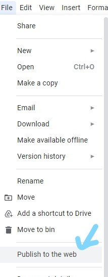
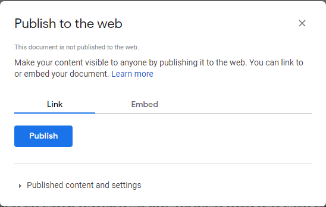
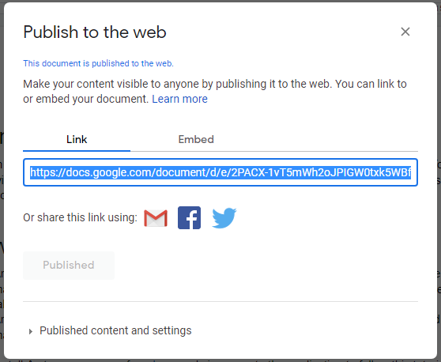

# Docs To MD CLI

Welcome to the codebase for the Docs TO MD CLI.

A Command Line Interface(CLI) tool that converts Google Docs files to MarkDown

## Usage

### Publish your Google Docs file to the web

* Select "Publish to the web" tab found under the file menu as seen in the image below:




* Click on the "Publish" button:




* Copy the Google Docs publish link under the link tab :




### Convert Google Docs to Markdown

```bash
$ python dtm.py <docs URL>
$ python dtm.py <docs URL> <local|docs>
```

### Converting Google Docs to MarkDown and Saving Images Locally

```bash
$ python dtm.py <docs URL> local
```

### Converting Google Docs to MarkDown and Saving Images on Google Servers

```bash
$ python dtm.py <docs URL> docs
```

## Author

* [LordGhostX](https://twitter.com/LordGhostX) - Everyone's Friendly Neighbourhood Ghost

## License

* MIT
